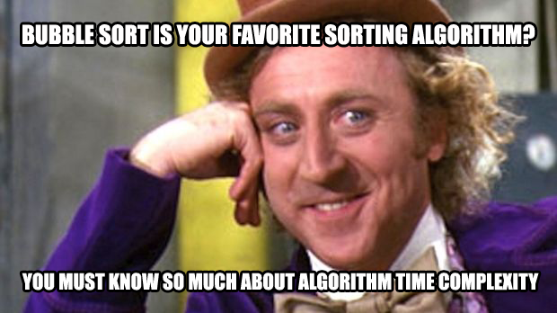

# 0x1B. C - Sorting algorithms & Big O
```C, Algorithm, Data structure ```

designed by: Alexandre Gautier

project done by team <b> (Leworkalush Getahun, Mengistu Messele) <b>

# Background Context
This project is meant to be done by groups of two students. Each group of two should pair program for at least the mandatory part.

## Resources
<b>Read or watch:<b>

- Sorting algorithm
- Big O notation
- Sorting algorithms animations
- 15 sorting algorithms in 6 minutes (WARNING: The following video can trigger seizure/epilepsy. It is not required for the project, as it is only a funny visualization of different sorting algorithms)
- CS50 Algorithms explanation in detail by David Malan
- All about sorting algorithms

# Data Structure and Functions
- print_array
- print_list

## header file
- sort.h

## Source files
- 0-bubble_sort.c, 0-O
- 1-insertion_sort_list.c, 1-O
- 2-selection_sort.c, 2-O
- 3-quick_sort.c, 3-O
- 100-shell_sort.c
- 101-cocktail_sort_list.c, 101-O
- 102-counting_sort.c, 102-O
- 103-merge_sort.c, 103-O
- 104-heap_sort.c, 104-O
- 105-radix_sort.c
- 106-bitonic_sort.c, 106-O
- 107-quick_sort_hoare.c, 107-O
- 1000-sort_deck.c, deck.h
